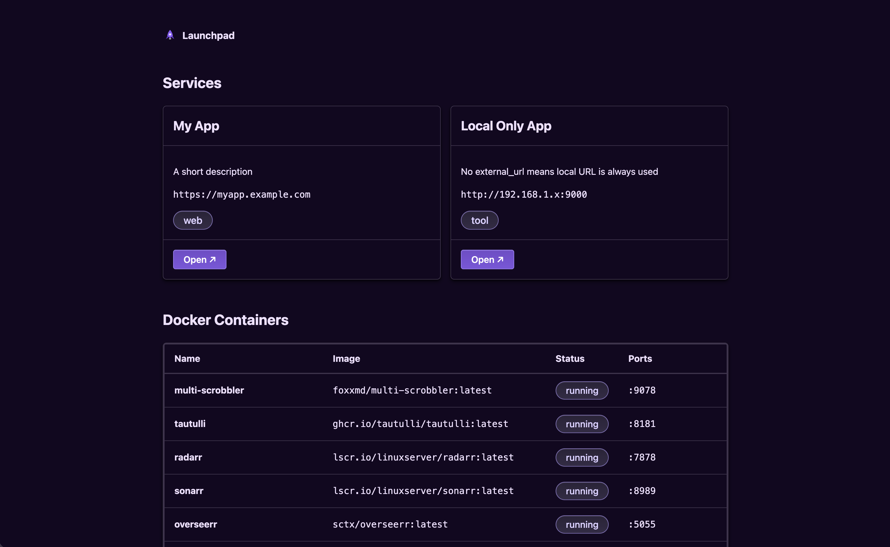

# Launchpad

A homeserver index page that displays your configured services and running Docker containers.



## Quick Start (Linux + systemd)

**Requirements:** Python 3.x, Docker (running)

```bash
curl -fsSL https://raw.githubusercontent.com/Flexicon/launchpad/main/install.sh | sudo bash
```

That's it. Launchpad will be running at **http://localhost:7777** and will start automatically on boot.

Then add your services:

```bash
cp /opt/launchpad/services.example.yaml /opt/launchpad/services.yaml
# edit the config with your preferred text editor
vim /opt/launchpad/services.yaml
```

The install script clones the repo to `/opt/launchpad`, creates a dedicated system user, installs Python dependencies into a virtualenv, and registers the systemd service.

## Manual Setup

Install dependencies:

```bash
pip install -r requirements.txt
```

Copy the example config and edit it to add your services:

```bash
cp services.example.yaml services.yaml
```

Run the app:

```bash
python app.py
```

Launchpad will be available at **http://localhost:7777**.

## Configuration

Edit `services.yaml`:

```yaml
services:
  - name: My App
    url: http://192.168.1.x:8080
    external_url: https://myapp.example.com  # optional, used when accessing remotely
    description: A short description
    tags: [web]
```

The `external_url` is used automatically when Launchpad is accessed from outside the local network.

## License

Public domain — see [UNLICENSE](UNLICENSE).
